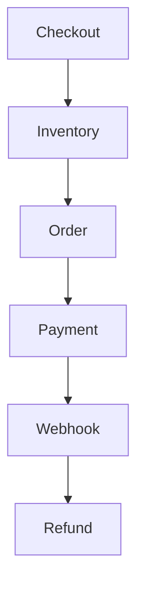

# E-Commerce Checkout with Unzer Payments

Spring Boot vertical slice for the Unzer take-home assignment demonstrating:

**Checkout → Inventory Reservation → Order → Payment → Webhook Reconciliation → Refund**



## Build

```powershell
.\mvnw.cmd clean test
.\mvnw.cmd clean package
```

All tests should pass successfully.

## Tech Stack

- Java 17
- Spring Boot
- PostgreSQL 16
- Spring Data JPA
- Flyway
- Unzer Java SDK
- Docker Compose
- Maven
- JUnit 5 / Mockito / AssertJ

## Features

- Product catalogue
- Atomic inventory reservation with overselling protection
- Order and payment lifecycle
- Idempotent payment creation
- Unzer Credit Card integration
- Unzer Wero redirect integration
- Unzer webhook reconciliation
- Duplicate webhook protection
- Full refund flow
- Global API error handling
- Unit and integration tests

### Payment Methods

| Method       | Status                   |
|--------------|---------------------------|
| Credit Card  | ✅ Implemented            |
| Wero         | ✅ Implemented            |
| Open Banking | ⏳ Extension / stub       |

The assignment requires Credit Card plus one redirect method in the working vertical slice; the remaining method may be designed/stubbed.

## Architecture

The application follows a **modular monolith / package-by-feature** structure:

```text
catalog/
checkout/
inventory/
order/
payment/
common/
```

Unzer-specific code is isolated behind an interface to keep checkout and domain logic independent of the payment SDK:

```text
CheckoutService
       │
       ▼
PaymentProvider (interface)
       │
       ▼
UnzerPaymentProvider
```

See [architecture.md](./architecture.md) for the complete system design, consistency strategy, AWS deployment, failure handling, and trade-offs.

## Consistency & Overselling

Inventory reservation uses an atomic conditional update:

```sql
UPDATE inventory
SET available_quantity = available_quantity - :quantity,
    reserved_quantity = reserved_quantity + :quantity
WHERE product_id = :productId
  AND available_quantity >= :quantity;
```

If zero rows are updated, the reservation fails.

A concurrent integration test verifies that when two customers compete for the final unit, only one succeeds. This directly addresses the assignment requirement to prevent overselling under concurrent checkout.

## Payment Flow

```text
POST /api/v1/checkout
        ↓
Create Order
        ↓
Reserve Inventory
        ↓
Persist Payment (PENDING)
        ↓
Start Payment via Unzer
        ↓
Customer Authentication
        ↓
Webhook
   ┌────┴─────┐
SUCCESS      FAILURE
   ↓            ↓
PAID        PAYMENT_FAILED
   ↓            ↓
Confirm       Release
Inventory     Inventory
```

The browser redirect is not treated as authoritative. Payment state is reconciled through Unzer/webhook state, as required by the assignment.

## API

```
GET  /api/v1/products
POST /api/v1/checkout
POST /api/v1/webhooks/unzer
POST /api/v1/payments/{paymentId}/refund
```

### Credit Card Checkout

```json
{
  "productId": 1,
  "quantity": 1,
  "paymentMethod": "CREDIT_CARD",
  "paymentTypeId": "s-crd-example"
}
```

Raw card details never reach this backend. The `paymentTypeId` should be generated using Unzer UI Components/tokenization.

### Wero Checkout

```json
{
  "productId": 1,
  "quantity": 1,
  "paymentMethod": "WERO",
  "paymentTypeId": null
}
```

The API returns the Unzer `redirectUrl` when required.

## Running Locally

### 1. Clone repository

```bash
git clone <repository-url>
cd unzer-ecommerce-assignment/backend
```

### 2. Start PostgreSQL

```bash
docker compose up -d
```

### 3. Configure Unzer

The private key is supplied through an environment variable and is never committed.

PowerShell:

```powershell
$env:UNZER_PRIVATE_KEY="YOUR_SANDBOX_PRIVATE_KEY"
```

### 4. Start the application

```powershell
.\mvnw.cmd spring-boot:run
```

Flyway migrations are applied automatically during application startup.

Application: `http://localhost:8080`

Health: `http://localhost:8080/actuator/health`

## Webhooks

For live Unzer webhook testing, expose the local endpoint using a tool such as ngrok or localtunnel:

```
POST /api/v1/webhooks/unzer
```

The assignment explicitly allows a tunnel for demonstrating local webhook handling.

## Tests

Run:

```powershell
.\mvnw.cmd clean test
```

Build:

```powershell
.\mvnw.cmd clean package
```

Key test scenarios:

- Inventory reservation
- Concurrent last-unit checkout
- Order lifecycle
- Payment lifecycle
- Payment idempotency
- Credit Card checkout
- Wero redirect checkout
- Payment success/failure reconciliation
- Duplicate webhooks
- Refunds

External Unzer API calls are mocked during automated tests to ensure deterministic execution.

## Security

- No API keys committed
- Secrets supplied through environment variables
- Raw card data never reaches the backend
- Idempotent webhook processing
- Centralized validation and API error handling
- Sandbox/test data only

## Known Limitations

The implementation intentionally focuses on the required vertical slice.

Out of scope for this vertical slice:

- Full customer/account system
- Full cart
- Shipping/fulfilment
- Open Banking flow
- Production authentication/authorization
- Reservation expiry worker
- Partial refunds
- Production AWS deployment

These are addressed in the architecture document.

The implementation intentionally keeps the README concise while the detailed design decisions are documented in `architecture.md`.

## Documentation

See [architecture.md](./architecture.md) for:

- Full e-commerce architecture
- Data model
- Checkout sequence
- Consistency strategy
- Failure scenarios
- AWS deployment
- Security / PCI considerations
- Trade-offs and future improvements

## License

This project was developed as part of the Unzer Software Engineering take-home assignment.