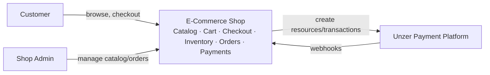
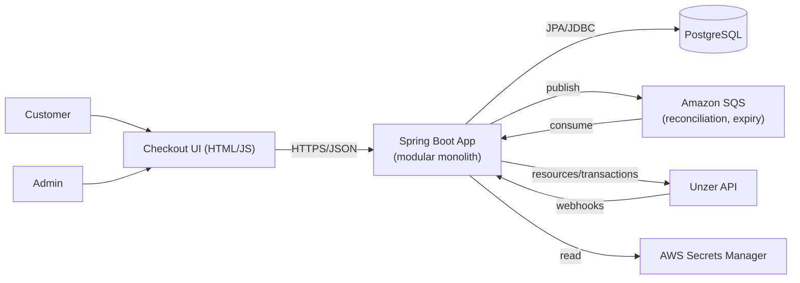
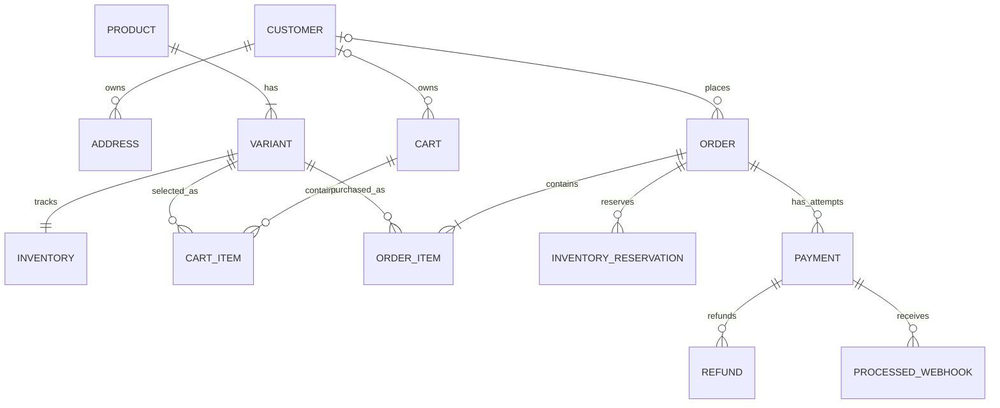
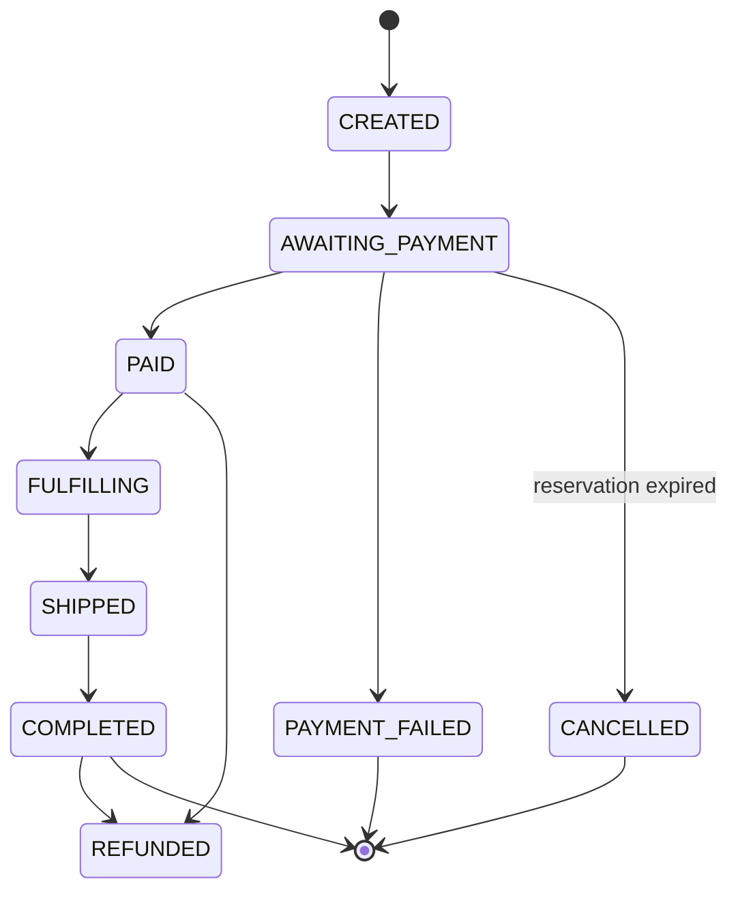
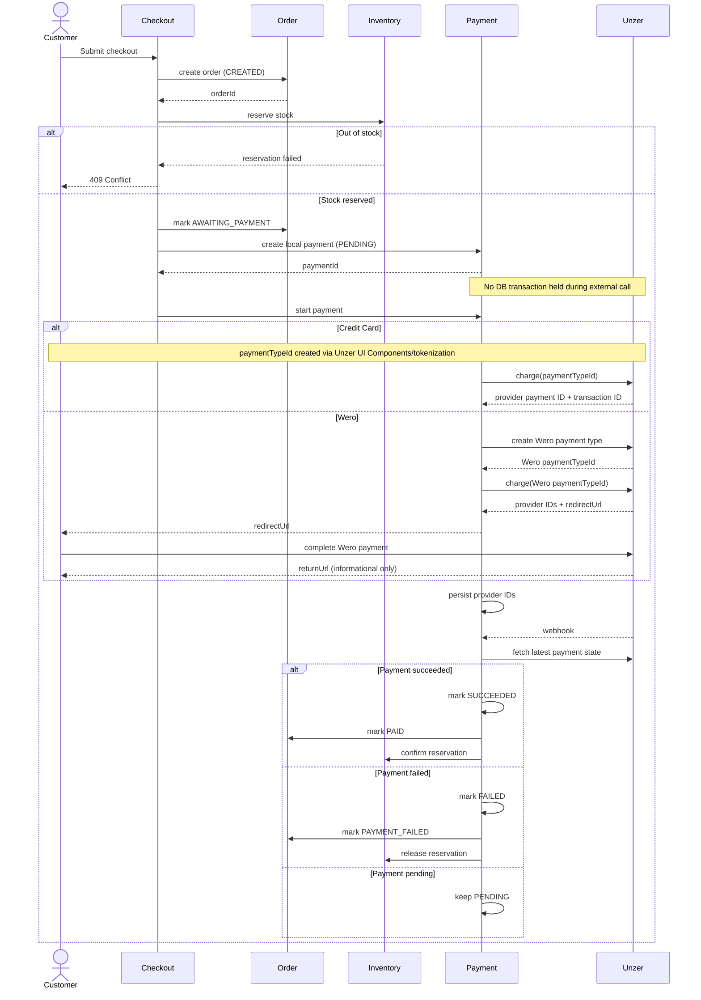
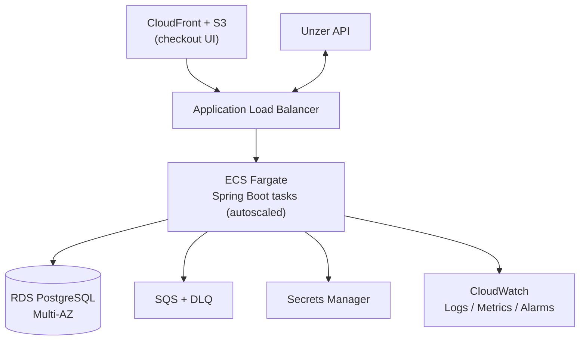

# E-Commerce Shop with Unzer Payments — Architecture

## 1. Overview & Assumptions

This document describes the architecture of an e-commerce backend integrating the Unzer payment platform. It covers customer accounts, catalog, cart, inventory, checkout, orders, and payments. The implementation is a **modular monolith** in Java 17 / Spring Boot; the code deliverable is a working vertical slice (checkout → payment → order confirmation) for Credit Card and Wero against the Unzer sandbox. Open Banking is kept as an extension point but is not implemented in the working slice.

**Assumptions:** PostgreSQL is the system of record; monetary values are stored as integer minor units + ISO 4217 currency; Unzer webhooks are the authoritative payment status source (not the browser redirect); raw card data never reaches our backend (Unzer UI Components/tokenization); secrets are env vars locally and AWS Secrets Manager in production; the frontend is a minimal checkout page, not a full storefront.

## 2. System Decomposition

Seven modules, each owning its own data, communicating through application services (not shared tables):

| Module | Owns | Responsibility |
|---|---|---|
| Customer | Customer, Address | Auth, roles (customer/admin), addresses |
| Catalog | Product, Variant | Browsing, search, admin CRUD |
| Cart | Cart, CartItem | Add/update/remove items |
| Inventory | Inventory, Reservation | Stock levels, reserve/confirm/release |
| Order | Order, OrderItem | Order lifecycle |
| Payment | Payment, Refund, ProcessedWebhook | Unzer integration, webhooks, refunds |
| Checkout | *(none — orchestrator only)* | Coordinates Order + Inventory + Payment |

**Why a modular monolith, not microservices:** at this scope, microservices add distributed-transaction and deployment overhead without payoff. Module boundaries are enforced at the code level (package-private internals, service interfaces as the only cross-module contract), so Catalog, Inventory, or Payment can be extracted into standalone services later if their load profile diverges — Catalog reads scale independently of Checkout writes, for example.

Key contracts: `InventoryService.reserve/confirm/release(...)`, `OrderService.createOrder/markAwaitingPayment/markPaid/markPaymentFailed/markRefunded`, and `PaymentProvider.startPayment/getPaymentStatus/refund`.





## 3. Domain & Data Model

Money is stored as `(amount_minor: bigint, currency: char(3))` to avoid float rounding. Inventory is tracked per **Variant**: `available_quantity`, `reserved_quantity`. Checkout creates an `InventoryReservation` (`ACTIVE → CONFIRMED | RELEASED | EXPIRED`) instead of deducting stock immediately. `OrderItem` snapshots product name/SKU/price at purchase time so historical orders are immutable. An `Order` can have multiple `Payment` attempts, each carrying an idempotency key, the Unzer payment-type resource ID, provider payment ID, and provider transaction ID. `ProcessedWebhook` stores unique event keys used to make webhook reconciliation idempotent.

Indexes: `Variant.sku` (unique), `Inventory.variant_id`, `Order.customer_id`, `Payment.order_id`, Payment.provider_payment_id (unique where present), Payment.idempotency_key (unique), ProcessedWebhook.event_key (unique)

The diagram below shows the primary entity relationships across Customer, Catalog, Cart, Order, and Payment:



The Order entity moves through the following lifecycle as it's driven by checkout, payment, and fulfillment events:



**Why PostgreSQL, single database:** ACID transactions and row-level locking are exactly what order/inventory/payment consistency needs; a single schema (module-partitioned via naming/ownership, not physical separation) keeps the reservation-UPDATE and order-creation atomic where required, while module boundaries stay logical, enforced in code, not by network calls.

## 4. Checkout & Payment Flow



Unzer specifics are hidden behind `PaymentProvider { startPayment(), getPaymentStatus(), refund() }`; Checkout/Order depend only on this interface, so adding a 4th method means one new implementation, not a Checkout change. The redirect `returnUrl` only renders a "processing" state — it never mutates Order/Payment. Only the webhook does, applied idempotently via the `ProcessedWebhook` table, so it's safe whether it arrives before or after the customer's browser returns.

## 5. Consistency & Failure Handling

**Overselling** is prevented with a single conditional update, avoiding both application-level locks and lost-update races:
```sql
UPDATE inventory
SET available_quantity = available_quantity - :qty, reserved_quantity = reserved_quantity + :qty
WHERE variant_id = :variantId AND available_quantity >= :qty;
```
Zero rows affected ⇒ insufficient stock, reservation rejected. Multi-item orders reserve all lines in one transaction (all-or-nothing).

**Idempotency:** payment creation and retries are keyed by an idempotency key (same key ⇒ same Payment record returned, no duplicate charge); payment creation uses a unique idempotency key, while webhook reconciliation uses a unique processed event key to avoid duplicate local transitions.

**Transaction boundaries:** local state (order + reservation + payment-attempt row) is committed *before* calling Unzer, so we never hold a DB transaction open across a network call. The Unzer response is persisted in a follow-up transaction Webhook processing then fetches the latest provider payment state using the stored provider payment ID before applying local Order, Payment, and Inventory transitions. — this avoids lock contention and means a crash mid-call leaves a safely-retryable "pending" record rather than a stuck lock.

**Reservation expiry:** In the target architecture, a scheduled worker would expire `ACTIVE` reservations past their TTL and return stock. This worker is not implemented in the current vertical slice."

**Failure walkthroughs:**
- *Payment succeeds, order-update fails:* Unzer identifiers are already persisted; a reconciliation job or the (idempotent) webhook retry re-applies the `PAID` transition. No second charge is ever issued for this.
- *Webhook before redirect:* order is already `PAID` when the customer's browser returns; return page just reads current state.
- *Unzer times out mid-charge:* treated as **unknown**, not failed — payment stays `PENDING`; we poll/reconcile using the stored resource ID rather than blindly re-charging.

Async work (reservation expiry, reconciliation polling, retries) runs via **Amazon SQS** with a DLQ for poison messages, keeping these off the request path.

## 6. Technology Choices (Java)

Spring Boot / Java 17, Spring Data JPA + PostgreSQL, Flyway for migrations. For Unzer, we use the **official Java SDK** rather than raw HTTP: it gives typed resource/transaction objects and reduces boilerplate for the create-resource → authorize/charge pattern shared by all three methods; the webhook *receiver*, however, is a plain Spring `@RestController` endpoint, since webhooks are inbound HTTP regardless of SDK.

Representative code — the trickiest part is idempotent webhook application:

```java
public void process(PaymentWebhookRequest request) {

        PaymentProviderStatus providerStatus =
        paymentProvider.getPaymentStatus(
        request.paymentId()
        );

        reconciliationService.reconcile(
        request,
        providerStatus
        );
        }

@Transactional
public void reconcile(
        PaymentWebhookRequest request,
        PaymentProviderStatus providerStatus
        ) {

        String eventKey =
        request.event()
        + ":"
        + request.paymentId()
        + ":"
        + providerStatus;

        if (processedWebhookRepository.existsByEventKey(eventKey)) {
        return;
        }

        Payment payment =
        paymentRepository
        .findByProviderPaymentId(request.paymentId())
        .orElseThrow();

        switch (providerStatus) {

        case SUCCEEDED -> {
        payment.markSucceeded();
        orderService.markPaid(payment.getOrderId());
        inventoryService.confirm(payment.getOrderId());
        }

        case FAILED -> {
        payment.markFailed();
        orderService.markPaymentFailed(payment.getOrderId());
        inventoryService.release(payment.getOrderId());
        }

        case REFUNDED -> {
        payment.markRefunded();
        orderService.markRefunded(payment.getOrderId());
        }

        case PENDING -> {
        // No local state transition.
        }
        }

        processedWebhookRepository.save(
        new ProcessedWebhook(eventKey)
        );
        }
```
Webhook reconciliation derives an `eventKey` from the incoming webhook and the provider status. Before applying any local state transition, the application checks whether that event has already been processed. A unique database constraint on `ProcessedWebhook.eventKey` provides an additional persistence-level safeguard against duplicate processing.

## 7. Deployment & AWS



- **Compute:** ECS Fargate behind an ALB; stateless app tasks scale horizontally on CPU/request-count. Read-heavy catalog traffic and write-heavy checkout traffic scale the same service today, but the module boundaries mean Catalog could move to its own Fargate service (with a read replica) without touching Checkout/Payment if that path becomes the bottleneck.
- **Data:** RDS PostgreSQL Multi-AZ; read replica optional for catalog/reporting.
- **CI/CD:** GitHub Actions — build → unit tests → integration tests, with Testcontainers and sandbox contract tests as future improvements → Docker image → push to ECR → Flyway migration → ECS rolling deploy.
- **Secrets:** Unzer API key and DB credentials in Secrets Manager, injected as task env vars; never in source or logs.
- **Observability:** structured logs with correlation ID propagated through checkout → Unzer call → webhook → async worker (CloudWatch Logs); metrics on payment success/failure rate and SQS queue depth (CloudWatch Metrics/Alarms); an alarm on payments stuck `PENDING` beyond a threshold triggers reconciliation review.

## 8. Security

Implemented:

- Card data never reaches the backend; payment details are expected to be collected using Unzer UI Components/tokenization.
- Payment secrets are externalized through environment variables.
- Payment credentials are never logged.
- Webhook processing is idempotent.

Production considerations:

- HTTPS everywhere
- Authentication and authorization (e.g. Spring Security)
- Webhook authenticity/signature verification
- AWS Secrets Manager for secret management

## 9. Trade-offs & Next Steps

Chosen: modular monolith over microservices (simplicity now, extractable later), single Postgres instance over per-module databases (transactional consistency across Order/Inventory), webhook-authoritative over redirect-authoritative payment confirmation (correctness over latency). Left out: full admin UI, real production deployment, distributed tracing, event sourcing/CQRS.

Future enhancements include:

- Implement Open Banking through the existing PaymentProvider abstraction
- Add reservation expiry worker
- Add partial refund support
- Add webhook signature/authenticity verification
- Add Testcontainers-based isolated integration tests